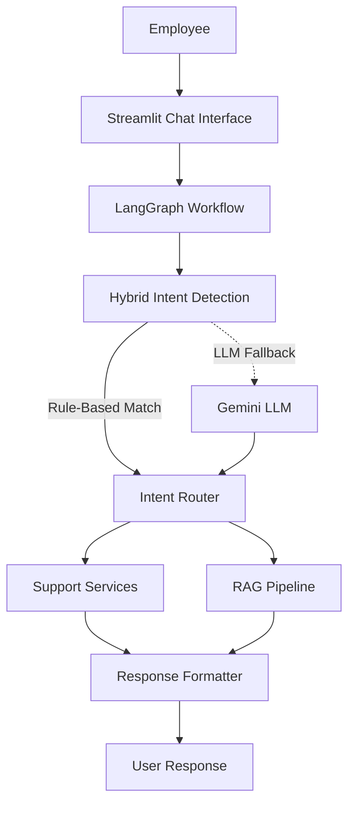
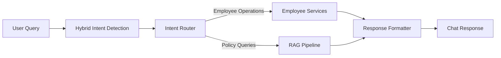
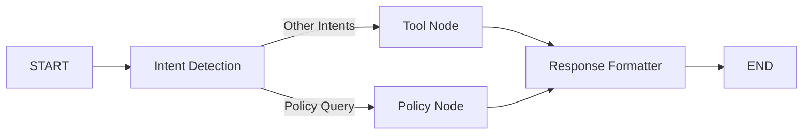
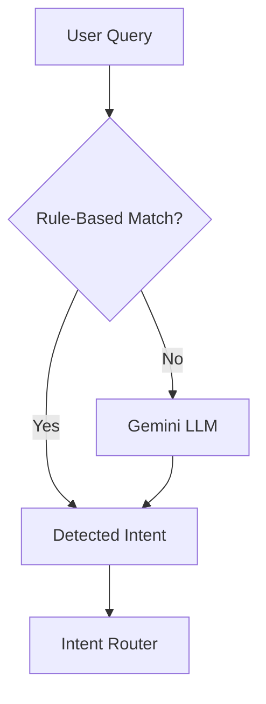

# 🤖 Employee Support AI

An AI-powered employee support assistant that simplifies common workplace operations through a conversational interface. The application enables employees to perform routine tasks such as password resets, leave management, ticket handling, employee profile retrieval, and company policy assistance from a single interface.

The project combines **Hybrid Intent Detection**, **LangGraph**, and **Retrieval-Augmented Generation (RAG)** to intelligently process employee requests. Routine operations are handled using predefined tools, while policy-related questions are answered using a RAG pipeline powered by **Google Gemini** and **FAISS**.

Built with a modular architecture, the application separates the user interface, workflow orchestration, business logic, and AI components, making it scalable, maintainable, and easy to extend with additional employee support services.

---

## ✨ Features

| Feature | Description |
| ------- | ----------- |
| 🔐 Password Reset | Generate a temporary password for employees. |
| 🔓 Account Unlock | Unlock employee accounts through the chatbot. |
| 📅 Leave Management | View leave balances and submit leave requests with persistent updates. |
| 👤 Employee Profile | Retrieve employee information including department, designation, manager, and location. |
| 🎫 Ticket Management | Create new support tickets and view existing tickets. |
| 📚 Policy Assistance | Answer company policy questions using Retrieval-Augmented Generation (RAG). |
| 🧠 Hybrid Intent Detection | Combines rule-based matching with Gemini LLM for accurate intent classification. |
| 🔄 LangGraph Workflow | Routes requests through modular workflow nodes for execution and response generation. |

---
## 🏗️ System Architecture

The Employee Support AI follows a modular architecture where every user request is processed through a LangGraph workflow. User queries are first analyzed using a hybrid intent detection strategy. Requests that match predefined patterns are handled directly, while paraphrased or unseen requests are forwarded to the Gemini LLM for intent classification. Once the intent is identified, the Intent Router directs the request either to the appropriate support service or to the RAG pipeline for policy-related queries. Finally, the Response Formatter converts the output into a user-friendly response that is displayed in the Streamlit chat interface.

---

---

## 🎯 Objectives

The primary objectives of this project are:

- Automate routine employee support operations through a conversational interface.
- Reduce manual HR and IT support effort for repetitive employee requests.
- Provide accurate and context-aware responses to company policy questions using RAG.
- Demonstrate the integration of LangGraph, Hybrid Intent Detection, and Large Language Models in a practical application.
- Build a modular and extensible architecture that can be expanded with additional employee support services.

---

# 🔄 Project Workflow

Employee Support AI follows a modular workflow orchestrated using **LangGraph**. Every user query passes through a sequence of processing stages, where the application determines the user's intent, routes the request to the appropriate service, and generates a user-friendly response.

Depending on the detected intent, requests are either handled by one of the employee support services or forwarded to the Retrieval-Augmented Generation (RAG) pipeline for company policy queries.

---

## Overall System Workflow

Every user request follows a common workflow. The query is first analyzed to determine its intent, after which it is routed either to an employee support service or to the RAG pipeline. Finally, the generated result is formatted before being displayed in the chat interface.

---

## LangGraph Execution Workflow

The application workflow is implemented using **LangGraph**, where each stage of execution is represented as an independent node. This modular approach makes the application easier to maintain and extend while allowing conditional routing based on the detected intent.

### Workflow Nodes

| Node | Responsibility |
|------|----------------|
| Intent Detection | Detects the user's intent using the Hybrid Intent Detection module. |
| Tool Node | Executes employee support operations such as password reset, leave management, profile retrieval, ticket management, greetings, and account unlock. |
| Policy Node | Processes company policy queries through the RAG pipeline. |
| Response Formatter | Converts structured tool outputs into user-friendly conversational responses. |

---

## Hybrid Intent Detection Workflow

The chatbot uses a hybrid intent detection strategy to balance execution speed with natural language understanding.

### How it works

1. The user submits a query.
2. The Rule-Based Intent Detector searches for predefined keywords and patterns.
3. If a matching intent is found, the detected intent is returned immediately.
4. If no suitable match exists, the query is forwarded to the Gemini LLM for intent classification.
5. The detected intent is then passed to the Intent Router for execution.

This hybrid strategy minimizes unnecessary LLM calls while still supporting natural language and paraphrased queries.

---
