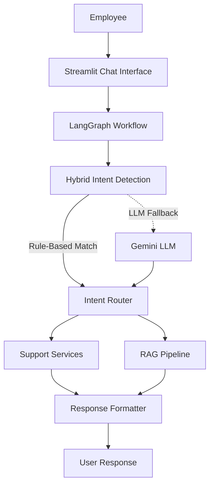
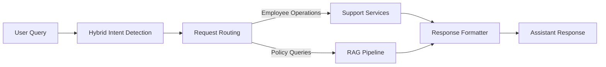
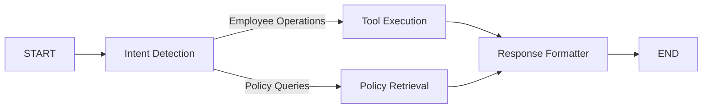
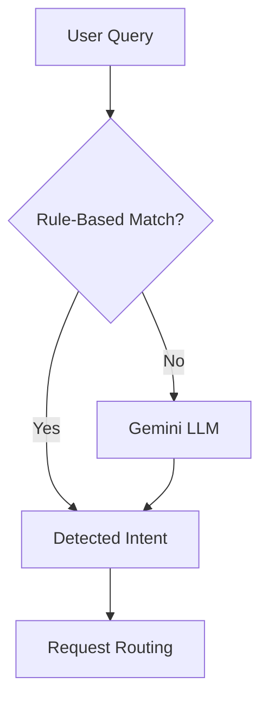

# 🤖 Employee Support AI

An AI-powered employee support assistant that simplifies common workplace operations through a conversational interface. The application enables employees to perform routine tasks such as password resets, leave management, ticket handling, employee profile retrieval, and company policy assistance from a single interface.

The project combines **Hybrid Intent Detection**, **LangGraph**, and **Retrieval-Augmented Generation (RAG)** to intelligently process employee requests. Routine operations are handled using predefined tools, while policy-related questions are answered using a RAG pipeline powered by **Google Gemini** and **FAISS**.

Built with a modular architecture, the application separates the user interface, workflow orchestration, business logic, and AI components, making it scalable, maintainable, and easy to extend with additional employee support services.

---

## ✨ Features

| Feature | Description |
| ------- | ----------- |
| 🔐 Password Reset | Generate a temporary password for employees. |
| 🔓 Account Unlock | Unlock employee accounts through the chatbot. |
| 📅 Leave Management | View leave balances and submit leave requests with persistent updates. |
| 👤 Employee Profile | Retrieve employee information including department, designation, manager, and location. |
| 🎫 Ticket Management | Create new support tickets and view existing tickets. |
| 📚 Policy Assistance | Answer company policy questions using Retrieval-Augmented Generation (RAG). |
| 🧠 Hybrid Intent Detection | Combines rule-based matching with Gemini LLM for accurate intent classification. |
| 🔄 LangGraph Workflow | Routes requests through modular workflow nodes for execution and response generation. |

---
## 🏗️ System Architecture



The Employee Support AI follows a modular architecture where every user request is processed through a LangGraph workflow. User queries are first analyzed using a hybrid intent detection strategy. Requests that match predefined patterns are handled directly, while paraphrased or unseen requests are forwarded to the Gemini LLM for intent classification. Once the intent is identified, the Intent Router directs the request either to the appropriate support service or to the RAG pipeline for policy-related queries. Finally, the Response Formatter converts the output into a user-friendly response that is displayed in the Streamlit chat interface.

---

---

## 🎯 Objectives

The primary objectives of this project are:

- Automate routine employee support operations through a conversational interface.
- Reduce manual HR and IT support effort for repetitive employee requests.
- Provide accurate and context-aware responses to company policy questions using RAG.
- Demonstrate the integration of LangGraph, Hybrid Intent Detection, and Large Language Models in a practical application.
- Build a modular and extensible architecture that can be expanded with additional employee support services.

---

# 🔄 Project Workflow

Employee Support AI follows a modular workflow orchestrated using **LangGraph**. Every user query passes through a sequence of processing stages where the application identifies the user's intent, routes the request to the appropriate execution path, and generates a conversational response.

Depending on the detected intent, requests are either handled by one of the employee support services or forwarded to the Retrieval-Augmented Generation (RAG) pipeline for company policy queries.

---

## Overall System Workflow



Every user request follows a common execution path. The query is first analyzed to determine the user's intent before being routed to the appropriate service. Operational requests such as password reset, leave management, ticket handling, and profile retrieval are processed by the support services, while company policy questions are answered through the RAG pipeline. Finally, the generated result is formatted into a conversational response and displayed to the user.

---

## LangGraph Execution Workflow

The application workflow is orchestrated using **LangGraph**, where each processing stage is represented as an independent workflow node. This modular design enables conditional routing, improves maintainability, and allows new services to be integrated with minimal changes to the overall architecture.



### Workflow Components

| Component | Responsibility |
|-----------|----------------|
| Intent Detection | Identifies the user's intent using the Hybrid Intent Detection module. |
| Tool Execution | Executes employee operations such as password reset, account unlock, leave management, profile retrieval, ticket management, greetings, and goodbye responses. |
| Policy Retrieval | Processes company policy questions through the Retrieval-Augmented Generation (RAG) pipeline. |
| Response Formatter | Converts structured outputs into user-friendly conversational responses before displaying them in the chat interface. |

---

## Hybrid Intent Detection Workflow

To balance execution speed with natural language understanding, the chatbot follows a hybrid intent detection strategy. Common employee requests are handled using predefined rules, while unfamiliar or paraphrased queries are delegated to the Gemini LLM for intent classification.



### Intent Detection Process

1. The user submits a query through the Streamlit interface.
2. The Rule-Based Intent Detector searches for matching keywords and predefined patterns.
3. If a matching intent is found, it is immediately returned.
4. If no suitable rule is matched, the query is forwarded to the Gemini LLM for intent classification.
5. The detected intent is then passed to the request routing stage for execution.

This hybrid strategy minimizes unnecessary LLM calls while still supporting natural language queries, paraphrased requests, and previously unseen user inputs.

---

# 📂 Repository Structure

```text
employee-support-ai/
│
├── chatbot/                  # Intent routing and response formatting
├── data/                     # Mock employee data and company policies
│   ├── policies/
│   ├── employees.json
│   ├── leave.json
│   └── tickets.json
│
├── evaluation/               # Intent evaluation and performance metrics
│
├── graph/                    # LangGraph workflow definition and nodes
│
├── intents/                  # Rule-based and LLM-based intent detection
│
├── rag/                      # RAG pipeline, vector store, and document loader
│
├── services/                 # Business logic for employee operations
│
├── tests/                    # Test datasets and evaluation queries
│
├── tools/                    # Employee support tools
│
├── ui/                       # Streamlit user interface components
│
├── utils/                    # Helper functions and utilities
│
├── app.py                    # Streamlit application entry point
├── config.py                 # Application configuration
├── requirements.txt          # Project dependencies
└── README.md
```

---

# 🚀 Getting Started

## Prerequisites

Make sure the following software is installed before running the application.

| Tool | Version |
|------|---------|
| Python | 3.11 or later |
| pip | Latest version |
| Git | Latest version |

Verify the installation:

```bash
python --version
pip --version
git --version
```

---

## 📥 Clone the Repository

```bash
git clone https://github.com/bhanusri-123/Employee-support-ai.git

cd Employee-support-ai
```

---

## 📦 Install Dependencies

Create a virtual environment (recommended):

### Linux / macOS

```bash
python -m venv .venv

source .venv/bin/activate
```

### Windows

```bash
python -m venv .venv

.venv\Scripts\activate
```

Install the required packages:

```bash
pip install -r requirements.txt
```

---

## ⚙️ Configure Environment Variables

Create a `.env` file in the project root and add your Google Gemini API key.

```env
GOOGLE_API_KEY=your_api_key_here
```

---

## ▶️ Run the Application

Start the Streamlit application:

```bash
streamlit run app.py
```

By default, the application runs at:

```
http://localhost:8501
```

If Streamlit automatically selects another available port, open the URL displayed in the terminal.

---

## 💬 Sample Conversations

The chatbot currently supports a variety of employee support requests.

### Password Management

```
Reset my password

I forgot my password

Unlock my account

I can't access my account
```

---

### Leave Management

```
How many leave days do I have remaining?

Apply for one day of annual leave

I need a sick leave

Show my leave balance
```

---

### Employee Profile

```
Show my profile

Who is my manager?

What department do I work in?
```

---

### Support Tickets

```
Create a support ticket

Raise a new ticket

Show my tickets

List all my support requests
```

---

### Company Policies

```
What is the work from home policy?

Explain the leave policy.

What does the travel policy say?

Tell me about the insurance policy.
```

---

### Greetings

```
Hello

Hi

Good Morning

Bye

Goodbye
```

---
