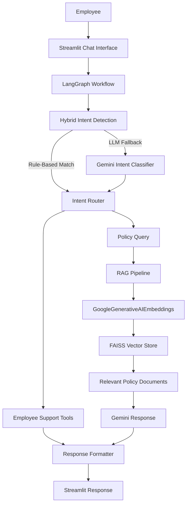

# 🤖 Employee Support AI

An AI-powered employee support assistant that simplifies common workplace operations through a conversational interface. The application enables employees to perform routine tasks such as password resets, leave management, ticket handling, employee profile retrieval, and company policy assistance from a single interface.

The project combines **Hybrid Intent Detection**, **LangGraph**, and **Retrieval-Augmented Generation (RAG)** to intelligently process employee requests. Routine operations are handled using predefined tools, while policy-related questions are answered using a RAG pipeline powered by **Google Gemini**, **GoogleGenerativeAIEmbeddings**, and **FAISS**.

Built with a modular architecture, the application separates the user interface, workflow orchestration, business logic, and AI components, making it scalable, maintainable, and easy to extend with additional employee support services.

---

## ✨ Features

| Feature | Description |
| ------- | ----------- |
| 🔐 Password Reset | Generate a temporary password for employees. |
| 🔓 Account Unlock | Unlock employee accounts through the chatbot. |
| 📅 Leave Management | View leave balances and submit leave requests with persistent updates. |
| 👤 Employee Profile | Retrieve employee information including department, designation, manager, and location. |
| 🎫 Ticket Management | Create new support tickets and view existing tickets. |
| 📚 Policy Assistance | Answer company policy questions using Retrieval-Augmented Generation (RAG). |
| 🧠 Hybrid Intent Detection | Combines rule-based matching with Gemini LLM for accurate intent classification. |
| 🔄 LangGraph Workflow | Routes requests through modular workflow nodes for execution and response generation. |

---

## 🏗️ System Architecture

---

## 🎯 Objectives

The primary objectives of this project are:

- Automate routine employee support operations through a conversational interface.
- Reduce manual HR and IT support effort for repetitive employee requests.
- Provide accurate and context-aware responses to company policy questions using RAG.
- Demonstrate the integration of LangGraph, Hybrid Intent Detection, and Large Language Models in a practical application.
- Build a modular and extensible architecture that can be expanded with additional employee support services.

---
