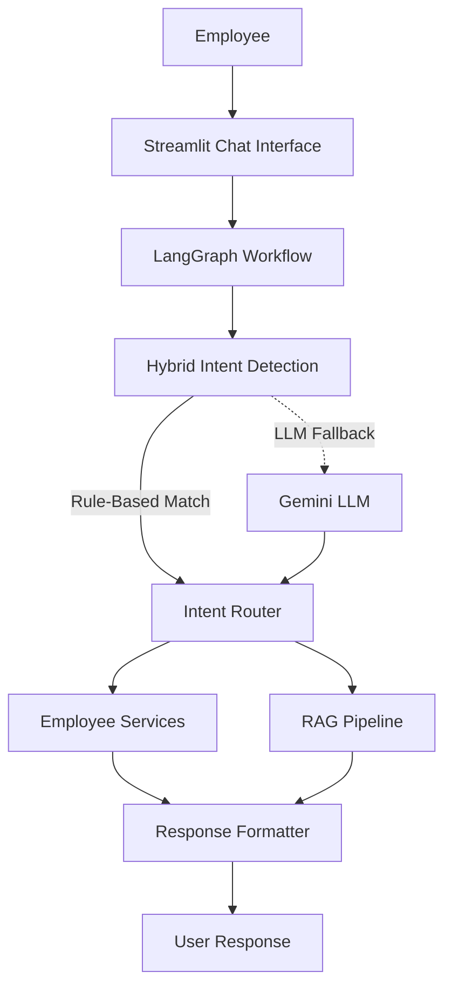
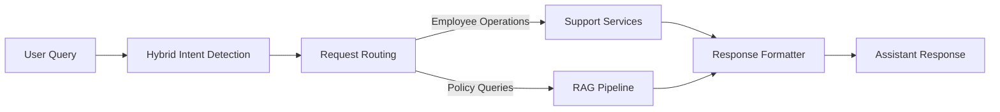
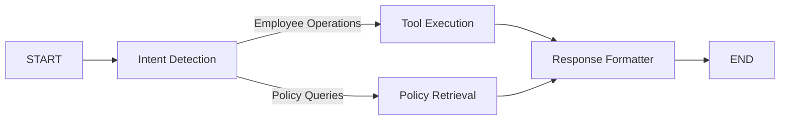
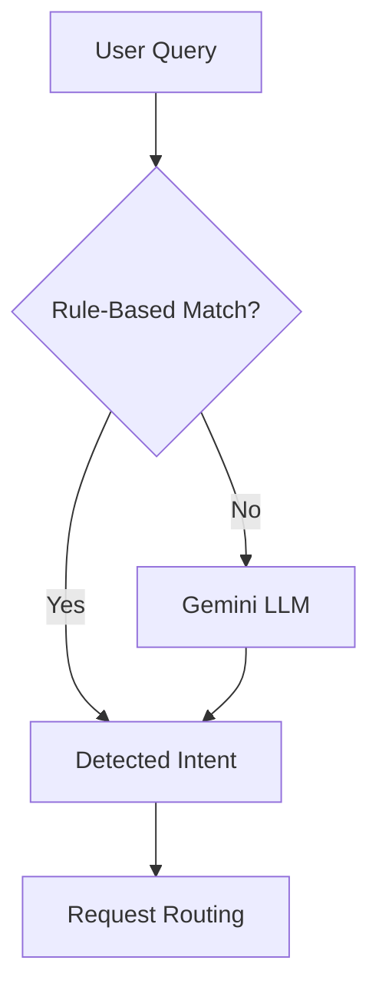
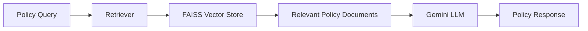

# 🤖 Employee Support AI


An AI-powered employee support assistant that simplifies common workplace operations through a conversational interface. The application enables employees to perform routine tasks such as password resets, leave management, ticket handling, employee profile retrieval, and company policy assistance from a single interface.

The project combines **Hybrid Intent Detection**, **LangGraph**, and **Retrieval-Augmented Generation (RAG)** to intelligently process employee requests. Routine operations are handled using predefined tools, while policy-related questions are answered using a RAG pipeline powered by **Google Gemini** and **FAISS**.

Built with a modular architecture, the application separates the user interface, workflow orchestration, business logic, and AI components, making it scalable, maintainable, and easy to extend with additional employee support services.

---

## ✨ Features

| Feature | Description |
| ------- | ----------- |
| 🔐 Password Reset | Generate a temporary password for employees. |
| 🔓 Account Unlock | Unlock employee accounts through the chatbot. |
| 📅 Leave Management | View leave balances and submit leave requests with persistent updates. |
| 👤 Employee Profile | Retrieve employee information including department, designation, manager, and location. |
| 🎫 Ticket Management | Create new support tickets and view existing tickets. |
| 📚 Policy Assistance | Answer company policy questions using Retrieval-Augmented Generation (RAG). |
| 🧠 Hybrid Intent Detection | Combines rule-based matching with Gemini LLM for accurate intent classification. |
| 🔄 LangGraph Workflow | Routes requests through modular workflow nodes for execution and response generation. |

---
## 🏗️ System Architecture



The Employee Support AI follows a modular architecture where every user request is processed through a LangGraph workflow. User queries are first analyzed using a hybrid intent detection strategy. Requests that match predefined patterns are handled directly, while paraphrased or unseen requests are forwarded to the Gemini LLM for intent classification. Once the intent is identified, the Intent Router directs the request either to the appropriate support service or to the RAG pipeline for policy-related queries. Finally, the Response Formatter converts the output into a user-friendly response that is displayed in the Streamlit chat interface.

---


## 🎯 Objectives

The primary objectives of this project are:

- Automate routine employee support operations through a conversational interface.
- Reduce manual HR and IT support effort for repetitive employee requests.
- Provide accurate and context-aware responses to company policy questions using RAG.
- Demonstrate the integration of LangGraph, Hybrid Intent Detection, and Large Language Models in a practical application.
- Build a modular and extensible architecture that can be expanded with additional employee support services.

---

# 🔄 Project Workflow

Employee Support AI follows a modular workflow orchestrated using **LangGraph**. Every user query passes through a sequence of processing stages where the application identifies the user's intent, routes the request to the appropriate execution path, and generates a conversational response.

Depending on the detected intent, requests are either handled by one of the employee support services or forwarded to the Retrieval-Augmented Generation (RAG) pipeline for company policy queries.

---

## Overall System Workflow



Every user request follows a common execution path. The query is first analyzed to determine the user's intent before being routed to the appropriate service. Operational requests such as password reset, leave management, ticket handling, and profile retrieval are processed by the support services, while company policy questions are answered through the RAG pipeline. Finally, the generated result is formatted into a conversational response and displayed to the user.

---

## LangGraph Execution Workflow

The application workflow is orchestrated using **LangGraph**, where each processing stage is represented as an independent workflow node. This modular design enables conditional routing, improves maintainability, and allows new services to be integrated with minimal changes to the overall architecture.



### Workflow Components

| Component | Responsibility |
|-----------|----------------|
| Intent Detection | Identifies the user's intent using the Hybrid Intent Detection module. |
| Tool Execution | Executes employee operations such as password reset, account unlock, leave management, profile retrieval, ticket management, greetings, and goodbye responses. |
| Policy Retrieval | Processes company policy questions through the Retrieval-Augmented Generation (RAG) pipeline. |
| Response Formatter | Converts structured outputs into user-friendly conversational responses before displaying them in the chat interface. |

---

## Hybrid Intent Detection Workflow

To balance execution speed with natural language understanding, the chatbot follows a hybrid intent detection strategy. Common employee requests are handled using predefined rules, while unfamiliar or paraphrased queries are delegated to the Gemini LLM for intent classification.



### Intent Detection Process

1. The user submits a query through the Streamlit interface.
2. The Rule-Based Intent Detector searches for matching keywords and predefined patterns.
3. If a matching intent is found, it is immediately returned.
4. If no suitable rule is matched, the query is forwarded to the Gemini LLM for intent classification.
5. The detected intent is then passed to the request routing stage for execution.

This hybrid strategy minimizes unnecessary LLM calls while still supporting natural language queries, paraphrased requests, and previously unseen user inputs.

---

## 📚 RAG Workflow

Policy-related queries are answered using a **Retrieval-Augmented Generation (RAG)** pipeline. Instead of relying solely on the language model's internal knowledge, the application retrieves relevant company policy documents from a FAISS vector store and provides them as contextual information to the Gemini LLM before generating a response.



### RAG Process

1. The user submits a company policy query.
2. The retriever performs semantic similarity search on the FAISS vector store.
3. The most relevant policy documents are retrieved.
4. Retrieved policy documents are provided as context to the Gemini LLM.
5. The generated response is returned to the Response Formatter before being displayed to the user.

---


# 📂 Repository Structure

```text
employee-support-ai/
│
├── chatbot/                  # Intent routing and response formatting
│   ├── intent_router.py
│   └── response_formatter.py
│
├── data/                     # Employee data and company policy documents
│   ├── employees.json
│   ├── leave.json
│   ├── tickets.json
│   └── policies/
│       ├── insurance_policy.txt
│       ├── leave_policy.txt
│       ├── office_policy.txt
│       ├── travel_policy.txt
│       └── wfh_policy.txt
│
├── evaluation/               # Evaluation framework and test dataset
│   ├── evaluator.py
│   ├── metrics.py
│   ├── report.py
│   └── test_dataset.json
│
├── graph/                    # LangGraph workflow implementation
│   ├── graph_builder.py
│   ├── nodes.py
│   ├── state.py
│   └── workflow.py
│
├── intents/                  # Hybrid intent detection
│   ├── hybrid.py
│   ├── keywords.py
│   ├── llm_classifier.py
│   ├── matcher.py
│   ├── normalizer.py
│   ├── parser.py
│   ├── prompt.py
│   └── rule_based.py
│
├── rag/                      # Retrieval-Augmented Generation pipeline
│   ├── loader.py
│   ├── rag_chain.py
│   ├── retriever.py
│   └── vector_store.py
│
├── services/                 # Business logic layer
│   ├── employee_service.py
│   ├── leave_service.py
│   └── ticket_service.py
│
├── tests/                    # Unit and workflow tests
│   ├── test_graph.py
│   ├── test_hybrid.py
│   ├── test_rag.py
│   ├── test_router.py
│   └── test_rule_based.py
│
├── tools/                    # Employee support tools
│   ├── employee_tools.py
│   ├── greeting_tool.py
│   ├── goodbye_tool.py
│   ├── leave_tool.py
│   ├── password_tool.py
│   ├── policy_tool.py
│   ├── profile_tool.py
│   ├── registry.py
│   └── ticket_tool.py
│
├── ui/                       # Streamlit UI components
│   ├── chat.py
│   ├── components.py
│   ├── sidebar.py
│   └── styles.py
│
├── utils/                    # Utility functions
│   ├── data_loader.py
│   └── response.py
│
├── app.py                    # Streamlit application entry point
├── config.py                 # Application configuration
├── requirements.txt          # Project dependencies
└── README.md
```

---

## 📁 Project Organization

The project follows a modular architecture where each package is responsible for a specific layer of the application, making the codebase easier to understand, maintain, and extend.

| Directory | Purpose |
|-----------|---------|
| `graph/` | Defines the LangGraph workflow and request routing logic. |
| `intents/` | Implements hybrid intent detection using rule-based matching with Gemini LLM fallback. |
| `tools/` | Contains the employee support tools executed after intent detection. |
| `services/` | Implements the business logic behind employee operations. |
| `rag/` | Handles document retrieval and policy question answering using RAG. |
| `ui/` | Contains the Streamlit user interface components. |
| `evaluation/` | Evaluates chatbot performance using predefined test datasets. |
| `data/` | Stores employee records, leave balances, tickets, and policy documents. |

---


# 🚀 Getting Started

## Prerequisites

Before running the application, ensure the following software is installed on your system.

| Tool | Version |
|------|---------|
| Python | 3.11 or later |
| pip | Latest version |
| Git | Latest version |

Verify the installation:

```bash
python --version
pip --version
git --version
```

---

## 📥 Clone the Repository

```bash
git clone https://github.com/bhanusri-123/Employee-support-ai.git

cd Employee-support-ai
```

---

## 📦 Install Dependencies

It is recommended to use a virtual environment.

### Linux / macOS

```bash
python -m venv .venv

source .venv/bin/activate
```

### Windows

```bash
python -m venv .venv

.venv\Scripts\activate
```

Install the required packages:

```bash
pip install -r requirements.txt
```

---

## ⚙️ Configure Environment Variables

Create a `.env` file in the project root and add your Google Gemini API key.

```env
GOOGLE_API_KEY=your_google_gemini_api_key
```

---

## ▶️ Run the Application

Launch the Streamlit application using:

```bash
streamlit run app.py
```

After the server starts successfully, open the URL displayed in the terminal (typically `http://localhost:8501`) in your browser.

---

# 💬 Sample Conversations

The chatbot currently supports the following employee operations.

### 👋 Greetings

```text
Hello
Hi
Good Morning
Bye
Goodbye
```

---

### 🔐 Password Management

```text
Reset my password
I forgot my password
Generate a temporary password
Unlock my account
I can't access my account
```

---

### 📅 Leave Management

```text
How many leave days do I have remaining?
Show my leave balance
Apply for one day of annual leave
I need a sick leave
Apply leave
```

---

### 👤 Employee Profile

```text
Show my profile
Who is my manager?
What department do I work in?
Show my employee details
```

---

### 🎫 Ticket Management

```text
Create a support ticket
Raise a new ticket
Show my tickets
List all my support requests
```

---

### 📚 Company Policies

```text
What is the work from home policy?
Explain the leave policy.
What does the travel policy say?
Tell me about the insurance policy.
What is the office policy?
```

---

# 🧰 Technology Stack

| Layer | Technology |
|--------|------------|
| Programming Language | Python |
| User Interface | Streamlit |
| Workflow Orchestration | LangGraph |
| Intent Detection | Hybrid (Rule-Based + LLM) |
| LLM | Google Gemini |
| Framework | LangChain |
| Vector Store | FAISS |
| Data Storage | JSON |
| Environment Management | python-dotenv |

---

# 📊 Evaluation

The project includes an evaluation module to measure the effectiveness of the Hybrid Intent Detection pipeline.

The evaluation is performed using a predefined test dataset containing employee support queries, paraphrased requests, and policy-related questions.

### Evaluation Metrics

| Metric | Description |
|--------|-------------|
| Accuracy | Percentage of correctly classified intents |
| Rule-Based Queries | Number of queries handled using rule-based detection |
| LLM Queries | Number of queries classified using Gemini |
| Average Confidence | Mean confidence score of predicted intents |
| Average Response Time | Average processing time per query |

Run the evaluation using:

```bash
python -m evaluation.report
```

---

# 🔮 Future Scope

The current implementation provides a strong foundation for an AI-powered employee support platform. Future enhancements may include:

- Multi-user authentication and role-based access
- Integration with enterprise HR and IT systems
- Persistent database support (PostgreSQL/MySQL)
- Dynamic policy document management
- Conversation history and context-aware responses
- Real-time ticket tracking
- Deployment using Docker
- Cloud deployment
- Administrative dashboard for managing employees, policies, and tickets

---

# 👩‍💻 Author

**Venigalla Bhanusri**

GitHub: https://github.com/bhanusri-123


---
